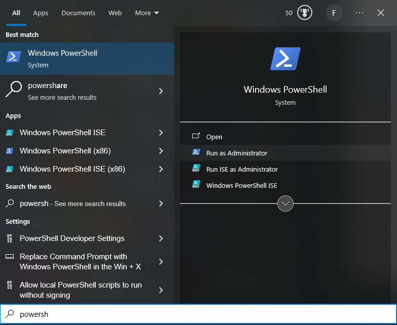
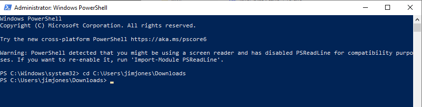
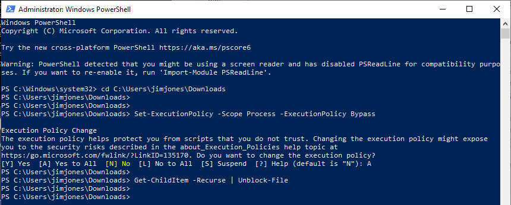
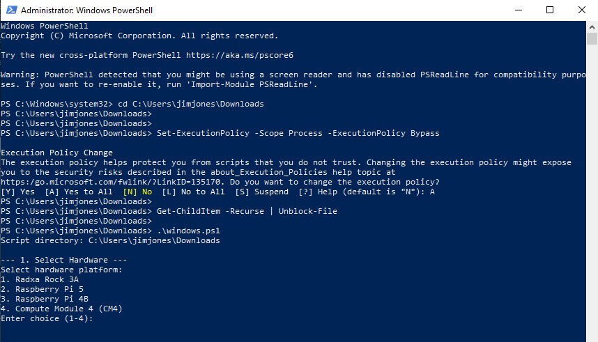
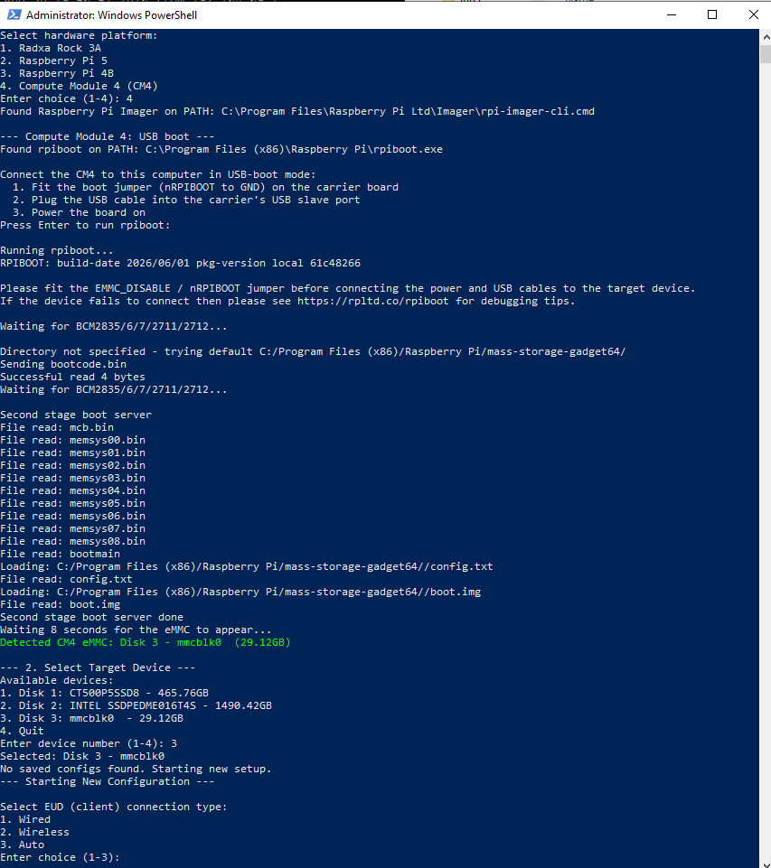
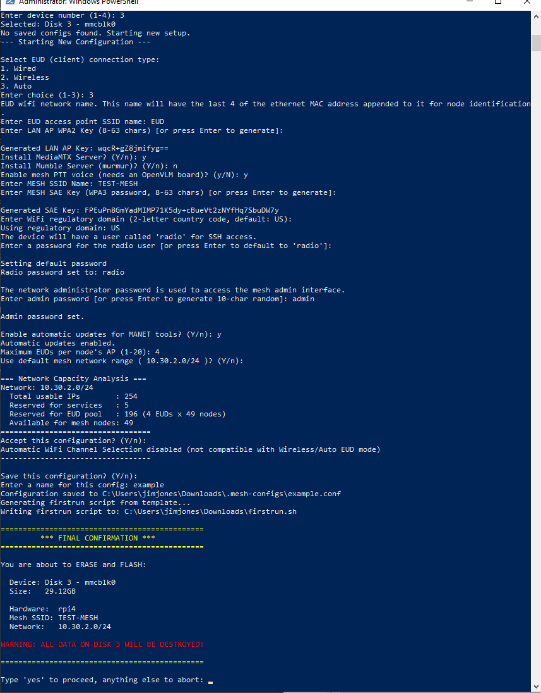
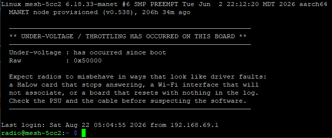

# Provisioning Guide

This directory contains the scripts and templates needed to flash a new mesh radio node.

---

## How It Works

The provisioning process has two phases:

**Phase 1 – Flashing (on your computer):** You run `linux.sh` or `windows.ps1` on your host machine. The script walks you through selecting hardware, loading or creating a configuration, then prepares and flashes the OS image to your target storage device. All your mesh settings are baked into the image during this step.

**Phase 2 – First Boot (on the node):** You insert the storage, connect Ethernet, and power on the node. A systemd service embedded in the image runs automatically once the network is available, downloads packages, configures the radio interfaces, and reboots into a fully functional mesh node.

---

## PREREQUISITES

You will need:
- A supported SBC. The **Compute Module 4 (CM4) is the current reference platform**; Raspberry Pi 5 and Radxa Rock 3A are also supported, though both are currently deprioritized because of thermal limits in enclosed builds. See the main README for the hardware support table.
- A Linux or Windows computer to flash from
- An SD card or cm4 eMMC, appropriate for your hardware
- Ethernet internet access on the node during its first boot

### Required tools (Linux host)

| Tool | Purpose | Install |
|------|---------|---------|
| `rpi-imager` | Flashing Raspberry Pi boards | `sudo apt install rpi-imager` |
| `rpiboot` | Mounting CM4 eMMC | `sudo apt install rpiboot` |
| `losetup` | Mounting Armbian image for Rock 3A | included in `util-linux` |
| `xz` | Decompressing downloaded Armbian images | `sudo apt install xz-utils` |
| `bc` | Network CIDR calculations | `sudo apt install bc` |
| `openssl` | Generating SAE keys | usually pre-installed |

> **CM4 on Linux:** `rpi-imager` and `rpiboot` are both required.

> **Raspberry Pi (5 / 4B) on Linux:** `rpi-imager` is required. `losetup` and `xz` are not required.

> **Rock 3A on Linux:** `rpi-imager` is not needed. `rpiboot` is not needed. You do need `losetup`, `xz`, `bc`, and `openssl`.

### Required tools (Windows host)

| Tool | Purpose | Install |
|------|---------|---------|
| `rpi-imager` | Flashing Raspberry Pi boards | [Download Installer](https://downloads.raspberrypi.com/imager/imager_latest.exe) |
| `rpiboot` | Mounting CM4 eMMC | [usbboot releases](https://github.com/raspberrypi/usbboot/releases) — CM4 only |
| Ext2Fsd | Mounting ext4 partitions for Rock 3A | Required for Rock 3A provisioning |

> **Finding these tools:** `windows.ps1` does not assume they are on the C: drive. It
> checks the usual install folders on *every* fixed drive, then `PATH`, then its own
> directory. If it still cannot find one it opens a window asking you to point at the
> program, with a **Download it** button if you do not have it yet. Your answer is saved
> in `.mesh-configs\tool-paths.json`, so you are only asked once per machine.
>
> A wrong answer cannot get stuck. Pointing at something that is clearly not the right
> program (`notepad.exe`, say) is used for that run only and never saved, and a saved
> location that then fails to flash is dropped automatically — the next run searches
> again, and only asks you if the search still comes up empty. Deleting
> `.mesh-configs\tool-paths.json` clears every saved location.

> **CM4 on Windows:** the script runs `rpiboot` for you, the same way the Linux script
> does. Connect the module in USB-boot mode when prompted; the script then reports which
> disk appeared so you can pick the right one.

> **Rock 3A on Windows — password hashing:** The script pre-creates the `radio` user by writing directly to `/etc/shadow`, which requires generating a Linux SHA-512 password hash on your Windows machine. The script tries `openssl` (available if Git for Windows is installed), then WSL, then Python. If none of these are available the `radio` account will be created with a locked password — you can still log in as `root` (password `1234`) and run `passwd radio` to set it manually. Having Git for Windows installed is the easiest way to satisfy this.

### Files needed from this directory

Clone or download the entire `provisioning/` directory to your working folder. The scripts require these files to be present alongside them:

- `linux.sh` — flashing script for Linux hosts
- `windows.ps1` — flashing script for Windows hosts
- `firstrun.sh.template` — Raspberry Pi first-boot script template
- `rock3a-provision.sh.template` — Rock 3A first-boot provisioning script template
- `additional-scripts/` — optional; your own setup scripts, baked into the
  image and run once on the node after setup completes. Empty is fine. See
  [additional-scripts/README.md](additional-scripts/README.md).

### Template tokens

`linux.sh` and `windows.ps1` bake mesh settings into the image by substituting
`__TOKEN__` placeholders in those templates at flash time. Edit the templates
using the tokens, not concrete values — a leftover `__MESH_SSID__` in a flashed
image means the substitution list in the flasher was not updated.

Tokens (same set on Linux and Windows):

`__HARDWARE_MODEL__` `__EUD_CONNECTION__` `__LAN_AP_SSID__` `__LAN_AP_KEY__`
`__MAX_EUDS_PER_NODE__` `__INSTALL_MEDIAMTX__` `__INSTALL_MUMBLE__`
`__VOICE_ENABLED__` `__MESH_SSID__` `__MESH_SAE_KEY__` `__LAN_CIDR_BLOCK__`
`__AUTO_CHANNEL__` `__RADIO_PW__` `__REGULATORY_DOMAIN__`
`__HALOW_REGULATORY_DOMAIN__` `__ADMIN_PW__` `__AUTO_UPDATE__`

Adding a new flash-time setting means the token in both templates **and** the
`sed` / `-replace` list in both flashers. The lists live in `linux.sh`
(`flash_rpi` and the Rock 3A path) and `windows.ps1`.

Scripts from `additional-scripts/` are inserted **after** substitution and are
never token-substituted, so a script containing a literal `__ADMIN_PW__`
retains it.

They are inserted at an anchor rather than appended. Both templates carry the
line:

```
# >>> MANET_ADDITIONAL_SCRIPTS <<<
```

The flashers replace that line with the generated heredocs, and remove it when
there is nothing to embed. An anchor is required because neither template
executes to its final line: `firstrun.sh.template` ends with completion
messages and `rock3a-provision.sh.template` ends with `reboot`, so an appended
block would never run. A template with the anchor removed causes the flasher to
abort rather than produce an image whose scripts have no effect.

### OS Images

**You do not need to download OS images manually.** The scripts handle this automatically:

- **Raspberry Pi (all models, including CM4):** `rpi-imager` downloads the correct Raspberry Pi OS Lite image directly from the Raspberry Pi Foundation's servers and caches it locally.

- **Rock 3A:** The script will offer to download the correct Armbian image automatically. If you already have an Armbian `.img` or `.img.xz` file locally, you can point the script to it instead. The expected image is Armbian Trixie (Debian 13) minimal for the Rock 3A — do not use a generic ARM64 image, it must be the board-specific build.

---

## RADIO HARDWARE

Each node carries two radios: an **MT7916** dual-band card for the 2.4/5 GHz 802.11ax mesh links, and an **802.11ah (HaLow)** radio for the long-range backhaul.

On the CM4 reference platform the HaLow radio can be attached two ways, and the software stack supports both:

- **MM6108 over SPI** (Seeed Wio-WM6108 module on a WM1302 Pi HAT) — covers the **NA 902–928 MHz** band only.
- **MM8108 over USB** (e.g. Lunpid USB MM8108 dongle) — covers **both NA 902–928 MHz and EU 863–870 MHz**.

> **European deployments must use the USB MM8108.** The MM6108 / FGH100M-H module does not operate in the EU 863–870 MHz ISM band.

For the SPI path, provisioning handles the hardware setup automatically: it enables SPI, loads the `mm610x-spi` device-tree overlay, drives the Morse power/reset GPIOs (3, 7, 17) high at boot, and — for the PCIe-attached MT7916 — adds the `pcie-32bit-dma` overlay. No manual `config.txt` editing is required.

The Raspberry Pi 5 and Rock 3A platforms use an MM8108 USB HaLow adapter (e.g. Gateworks GW16167 or Lunpid) rather than the SPI module.

---

## FLASHING

From the `provisioning/` directory, run the script matching your host OS:

```bash
# Linux
bash linux.sh
```

### Windows: step by step

Windows blocks PowerShell scripts by default, so there are two things to do before
`windows.ps1` will start. This is normal Windows behaviour, not a fault in the script.

#### 1. Open PowerShell as Administrator

Click Start, type `powershell`, then choose **Run as Administrator** from the panel on
the right. The window title must begin with **Administrator:** — if it does not, the
script refuses to run and tells you so.



#### 2. Change to the folder you downloaded

Type `cd` followed by the folder containing `windows.ps1`. If you unzipped it into your
Downloads folder that is:

```powershell
cd C:\Users\<your-username>\Downloads
```



#### 3. Allow the script to run

```powershell
Set-ExecutionPolicy -Scope Process -ExecutionPolicy Bypass
Get-ChildItem -Recurse | Unblock-File
```

**The first command asks you to confirm, and the default answer is No.** Pressing Enter
refuses the change and the script still will not start. Type **`A`** (Yes to All) and
press Enter.

The second command clears the "came from the internet" mark that Windows puts on every
file inside a `.zip`. Skip it and the script is still blocked, this time with a
different error about not being digitally signed.

Both apply to this window only. Nothing is changed permanently, and closing the window
undoes them.



#### 4. Start the flasher

```powershell
.\windows.ps1
```



If you would rather not change the execution policy at all, this single command does the
same job without altering any setting:

```powershell
powershell.exe -ExecutionPolicy Bypass -File .\windows.ps1
```

The exact errors you get if you skip any of this are listed under
[TROUBLESHOOTING](#troubleshooting).

#### 5. Answer the questions

For CM4 the script finds `rpiboot`, asks you to connect the module in USB-boot mode,
runs it for you, and reports which disk appeared so you can pick the right one:



#### 6. Confirm before anything is written

Nothing is written to the card until you type `yes` here. Check the device and size —
everything on that disk is erased.



The script will:
1. Ask you to select your hardware platform (Rock 3A, Pi 5, Pi 4B, or CM4 — **select CM4 for the current reference build**)
2. Offer to load a saved configuration or create a new one
3. Acquire the OS image (download automatically or use a local file)
4. Ask you to select the target device
5. Show a final confirmation before writing — **all data on the target will be erased**
6. Flash and configure the image

> **Saved configs:** The script saves configurations to a `.mesh-configs/` directory so you can re-flash nodes with the same settings quickly.

> **CM4 on Linux:** When you select CM4, the script will prompt you to connect the module in USB-boot mode, then run `rpiboot` automatically and detect the newly mounted eMMC device. CM4 is flashed through the Raspberry Pi (Pi 4) image path.

---

## SETUP OPTIONS

The script will ask the following questions. These can also be loaded from a saved config file.

### 1. EUD (End User Device) Connection Type

How EUDs connect to this mesh node:

- **Wired** — EUDs connect via Ethernet (or Ethernet-to-USB adapter). No Wi-Fi AP is broadcast. Both 2.4 and 5 GHz radios join the MANET mesh. Connecting the node to an internet-enabled network makes it a mesh gateway.
- **Wireless** — The node broadcasts a 5 GHz 802.11ax access point at low power (5 dBm) for EUDs to join. Connecting to an upstream network enables gateway mode. Wired EUDs also work.
- **Auto** — Behaves as Wireless until a wired EUD is detected, then stops broadcasting the AP.

### 2. Install MediaMTX Server?

If yes, a MediaMTX streaming server will be elected to run somewhere on the mesh. Its reserved address ends in `.2` of your chosen network range (e.g. `10.30.1.2` on a `10.30.1.0/24` network).

### 3. Install Mumble Server?

If yes, a Mumble voice server will be available on the mesh at the address ending in `.3` (e.g. `10.30.1.3`). Note: Mumble integration is currently untested.

### 4. Enable mesh PTT voice?

Push-to-talk voice over the mesh, using a headset and PTT switch plugged into
the node itself — not a browser. Defaults to **no**, because it needs an
OpenVLM (C-Media CM108B) board fitted for the mic amp and PTT switch; a node
without one would run the daemon to no purpose.

**Talk group is not asked here.** Every node is flashed on group 1, and the
operator changes it from the VOICE tab of the web UI — it is a per-radio
setting like the channel knob on a handheld, not a fleet-build decision, and
baking it into the image would mean reflashing to change channel.

This writes `voice=` and `voice_channel=1` to `/etc/mesh.conf`.
`mesh-voice.service` is enabled on every node regardless, but exits immediately
unless `voice=y` — so answering no here costs nothing, and turning voice on
later is a `mesh.conf` edit plus `systemctl start mesh-voice`.

### 5. Mesh SSID

The SSID all nodes use to form the MANET mesh.

### 6. Mesh SAE Key

The WPA3-SAE encryption key for the mesh. A key will be generated automatically if you leave this blank (recommended).

### 7. Network CIDR Block

The IPv4 network range for the mesh (e.g. `10.30.1.0/24`). Node addresses, EUD DHCP ranges, and service addresses are all allocated from this block.

### 8. Max EUDs per Node

The maximum number of end-user devices each node will serve. This controls DHCP pool sizing.

### 9. Regulatory Domain

Your country code for Wi-Fi regulatory compliance (e.g. `US`, `GB`, `AU`). A matching HaLow regulatory region is derived from this automatically — see **Radio Hardware** above for the EU band caveat (EU nodes need the USB MM8108).

### 10. Auto Channel Selection

If enabled, nodes negotiate channel selection automatically. If disabled, a fixed channel is used.

### 11. Passwords

- **Radio user password** — SSH/login password for the `radio` account on the node.
- **Admin password** — Gates the management UI at `http://<node>/manage`. Stored
  as `admin_password` in `/etc/mesh.conf`. The status page at `http://<node>/`
  needs no password; everything that can change this node or the mesh does.

### 12. Additional setup scripts (not prompted)

Files placed in `additional-scripts/` are embedded in the image and run **once
as root on the node, after setup completes**. The flasher does not prompt for
this: it validates the contents of the directory and reports what will be
embedded before writing to the card.

The directory is intended for site-specific configuration outside the scope of
the mesh build — static routes, organisation SSH keys, additional packages, or
a site daemon.

```
   10-site-routes.sh                    ok    bash -n clean
   20-org-ssh-keys.sh                   ok    bash -n clean
   README.md                            SKIP  no #! on line 1
```

Scripts may be written in any language a node provides — bash, dash, python3,
perl, lua or awk — selected by the shebang. Other interpreters must be
installed by an earlier script. Scripts run in filename order, each with a
300 s limit. Failures are reported
on the login banner and never mark the node unprovisioned. The full rules,
including the handling of data files and the reason secrets must not be placed
here, are in
[additional-scripts/README.md](additional-scripts/README.md).

---

## FIRST BOOT

Insert the storage media, connect Ethernet, and power on the node. What happens next depends on the hardware:

### Raspberry Pi (all models including CM4)

The `firstrun.sh` script runs on the very first boot (injected by `rpi-imager`). It:

1. Disables the default Raspberry Pi setup wizard
2. Creates the `radio` user account
3. Enables SSH
4. Creates and enables a `mesh-provision` systemd service for the next stage

After a reboot, `provision-mesh.sh` runs once network is available. It:

1. Waits for internet connectivity (up to 5 minutes)
2. Sets the Wi-Fi regulatory domain
3. Calculates a unique hostname from the node's MAC address
4. Installs required packages (`batctl`, `wpa_supplicant`, etc.)
5. Configures network interfaces, mesh settings, and DHCP
6. Disables itself and reboots into the final mesh configuration

The full process takes a few minutes and involves two reboots.

### Rock 3A

The provisioning script and all configuration are embedded directly into the Armbian image during flashing. No `rpi-imager` first-run injection is involved.

On first boot, a `mesh-provision` systemd service (triggered by the presence of a `/root/.mesh-not-provisioned` flag file) runs `provision-mesh.sh`. The `radio` user account is pre-created during image preparation, so there is no interactive setup wizard to bypass.

The provisioning script:

1. Waits for internet connectivity
2. Installs required packages
3. Configures interfaces and mesh settings
4. Removes the trigger flag file and reboots

After the reboot the node is fully operational.

---

## FINAL SETUP — `radio-setup.sh`

`radio-setup.sh` is the last provisioning stage and does most of the node-specific radio and service configuration. The earlier stages enable it to run once on the following boot (via `radio-setup-run-once.service`, after a short delay) — by then the wireless drivers have loaded and the radio interfaces actually exist, which is what this stage depends on. It is the "final mesh configuration" the boot flow above reboots into, and runs on both the Raspberry Pi / CM4 and Rock 3A platforms.

It performs:

- **Interface detection and naming.** Waits for the wireless PHYs to appear, classifies each interface as 2.4 GHz mesh, 5 GHz mesh, HaLow, or non-mesh (EUD AP), and writes MAC-keyed `.link` files so the names stay stable across reboots. If an interface still needs renaming, it stages a one-shot re-run and reboots once, so the rest of the configuration is written against the final names.
- **Per-interface supplicant configs.** Writes `wpa_supplicant` mesh-point / SAE configs for the 2.4 and 5 GHz radios and `wpa_supplicant_s1g` (S1G) configs for the HaLow interface, along with the matching `systemd-networkd` link/network files.
- **HaLow / Morse setup.** Sets the HaLow TX power, writes `/etc/modprobe.d/morse.conf` and the `cfg80211` regulatory domain (including EU handling), and ensures the SPI overlay, Morse power/reset GPIOs, and CM4 `pcie-32bit-dma` settings are present in `config.txt`.
- **Core services.** Enables and starts the mesh stack — `alfred`, BATMAN-adv (`batman-enslave`), `node-manager`, `radvd`, and `chrony` — plus support services for LED/button handling, SSH recovery, cloned-identity reset, the boot lobby channels, and one-shot time sync.
- **Optional services.** Brings up MediaMTX, Mumble, and GPS/NTP (`gpsd`, `gps-reader.service`, chrony `SHM 0`) when selected or present.
- **Identity and web UI.** Derives the hostname from the node's MAC (`mesh-XXXX`) and starts the web server (`mesh-status.py`) on port 80 — open status page at `/`, password-gated management UI at `/manage`. Also advertises the node as `manet.local` over mDNS on the EUD-facing interface only.

When it finishes — and after any pending interface rename has settled — it disables its own run-once service, marks the node provisioned, and brings the mesh up by restarting `systemd-networkd`, the supplicants, `node-manager`, BATMAN-adv, and `alfred`. Output is logged to `/var/log/radio-setup.log`.

Finally, on a run that reaches this point with no recorded failures, it starts
`manet-user-scripts.service`, which runs the operator scripts embedded from
`additional-scripts/`. The unit is started with `--no-block` so that operator
code cannot delay the completion of provisioning, and its conditions restrict
it to a single run. Output is written to `/var/log/manet-user-scripts.log`.

---

## DEFAULT CREDENTIALS

| Account | Username | Default Password |
|---------|----------|-----------------|
| SSH / radio user | `radio` | Set during provisioning |
| Armbian root (Rock 3A) | `root` | `1234` (Armbian default — change this) |

---

## TROUBLESHOOTING

### Windows: the script will not start

**`... cannot be loaded because running scripts is disabled on this system`**

Windows' execution policy is blocking the script. This is the default on Windows and
affects every PowerShell script, not just this one. In an **Administrator** PowerShell
window, in the `provisioning` folder:

```powershell
Set-ExecutionPolicy -Scope Process -ExecutionPolicy Bypass
.\windows.ps1
```

`Set-ExecutionPolicy` asks you to confirm and **the default answer is No**, so pressing
Enter leaves the script just as blocked. Answer **`A`** (Yes to All). It applies to the
current window only and is forgotten when you close it.

**`... is not digitally signed. You cannot run this script on the current system.`**

Different cause, different fix. Windows tags files that came from the internet — most
often because the repository was downloaded as a `.zip` — and keeps blocking them even
once scripts are allowed. Clear the tag, in the `provisioning` folder:

```powershell
Get-ChildItem -Recurse | Unblock-File
.\windows.ps1
```

**`The script ... cannot be run because it contains a "#requires" statement for running as Administrator`**

The PowerShell window is not elevated. Close it and reopen with right-click on the Start
button, then *Terminal (Admin)* or *Windows PowerShell (Admin)*.

### Provisioning

**Provisioning logs (Raspberry Pi):**
- Phase 1 (firstrun): `/boot/firmware/firstrun.log`
- Phase 2 (mesh provisioning): `/boot/firmware/provision.log`
- Radio setup: `/var/log/radio-setup.log`
- Operator setup scripts: `/var/log/manet-user-scripts.log`

**Provisioning logs (Rock 3A):**
- `/var/log/mesh-provision.log`
- `/var/log/radio-setup.log`

**Radios misbehaving — check power first.** A HaLow card that stops answering, a Wi-Fi
interface that will not associate, or a board that resets with nothing in the log are all
symptoms of an inadequate supply rather than a software fault. The node reports this
itself, on the SSH login banner and on the web status page:



`manet-power-status.sh` on the node prints the same thing on demand, and
`vcgencmd get_throttled` gives the raw value (`0x0` is clean; bit 0 set means it is
under-volting right now; bits 16 and up mean it has happened since boot). Check the PSU
and the cable before suspecting the software.

**Node hasn't provisioned after 10 minutes:** Check that Ethernet is connected and has a working internet connection. The provisioning script waits up to 5 minutes for connectivity before timing out.
