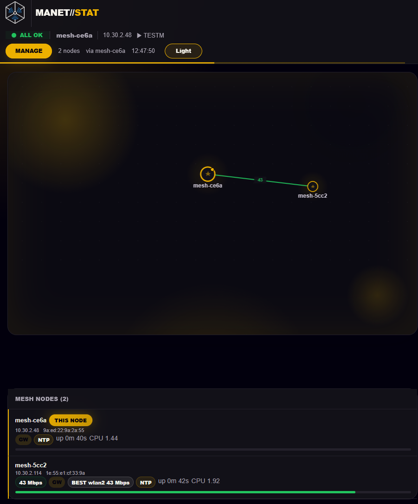
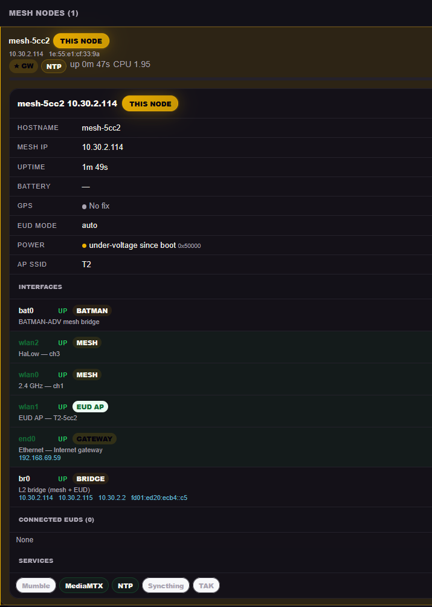
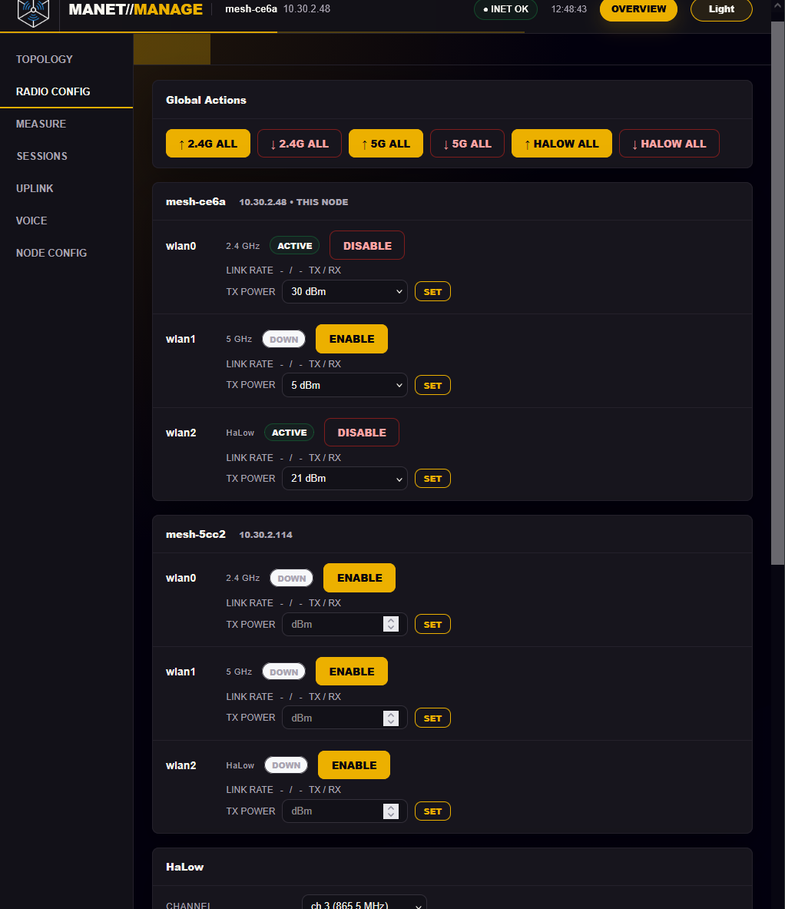
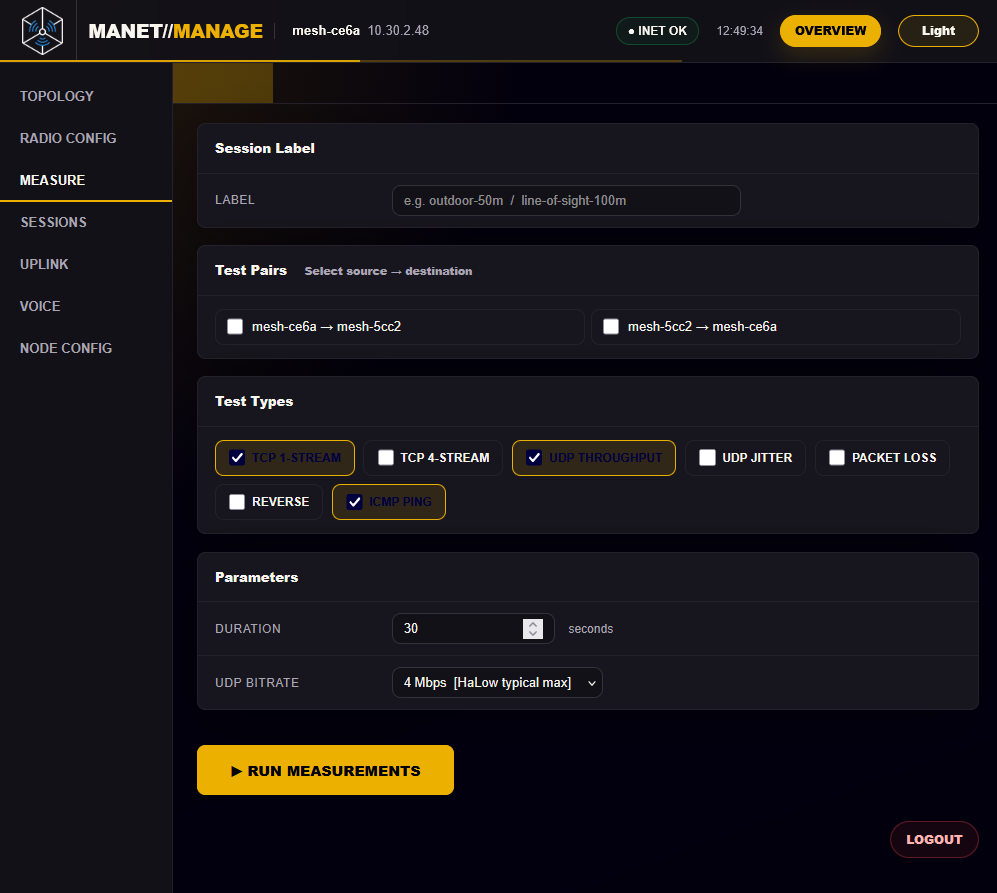

# MANET Project

This repository contains a complete software suite for provisioning, configuring, and orchestrating Mobile Ad-hoc Network (MANET) nodes on Single Board Computers (SBCs).

The project transforms hardware like a Rock3a or a Raspberry Pi CM4 (recommended) into self-forming, self-healing mesh nodes using **B.A.T.M.A.N. Advanced** (Layer 2 routing) and **802.11s / 802.11ah HaLow** (Layer 1/2). It features orchestration for automatic addressing and channel selection, partition healing, jamming detection, and decentralized service elections.

## Key Features

* **Advanced Mesh Networking**:
    * Utilizes `batman-adv` (BATMAN V algorithm) for Layer 2 routing.
    * Supports standard 802.11ax/ac/n (2.4GHz/5GHz) and long-range 802.11ah (Wi-Fi HaLow).
    * **Auto-Channel Selection (ACS)**: Decentralized scanning and election to avoid interference.
    * **Limp Mode**: Detects jamming/interference and automatically downgrades bitrates to maintain connectivity.
* **Zero-Conf Architecture**:
    * **Distributed IPv4 Management**: Nodes automatically claim non-conflicting IP chunks for connected clients (EUDs).
    * **IPv6 Support**: SLAAC for mesh infrastructure and auto-configured gateways.
    * **EUD Support**: Connect End User Devices (phones/laptops) via Ethernet or a local WiFi Access Point.
* **Resilience & Healing**:
    * **Tourguide System**: Detects network partitions and "guides" isolated clusters back to the main mesh.
    * **Quorum Checking**: Monitors network health and resets isolated nodes to a "Lobby" state to re-establish connections.
* **Decentralized Services**:
    * **Service Elections**: Nodes elect hosts for services like **MediaMTX** (video streaming); the best-connected node wins, measured by mean BATMAN_V throughput.
    * **Distributed NTP**: Time synchronization across the mesh without internet access.

## Repository Structure

* **`provisioning/`**: Scripts and templates for flashing the OS image.
    * `additional-scripts/`: optional site-specific setup scripts, embedded in the image and run once on the node after setup finishes.
* **`node_tools/`**: The runtime logic for the node. Contains the scripts that run the mesh, including:
    * `node-manager`: The core orchestrator for cooperative mesh functions.
    * `radio-setup.sh`: Initial provisioning tool.
    * `mesh-registry-builder.sh`: Decodes gossip data (via Alfred) to build a map of the network.
* **`binaries_arm64/`**: Pre-compiled custom binaries for ARM64, including `alfred`, `batctl`, and a modified `wpa_supplicant` for HaLow support.
* **`packaging/`**: Builders for the install and tools tarballs, per board.
* **`systemd/`, `systemd-network/`, `udev/`, `networkd-dispatcher/`, `etc/`**: Units, network and hook files installed onto the node.

## Supported Hardware

| Hardware | Support Level | Notes |
| :--- | :--- | :--- |
| **Compute Module 4 (CM4)** | Functional, primary dev target | Supports 802.11ax + HaLow. |
| **Raspberry Pi 4B** | Untested |  |
| **Raspberry Pi 5** | Functional, not a focus | Supports 802.11ax + HaLow. |
| **Radxa Rock 3A** | Functional, not a focus | Supports 802.11ax + HaLow. |

The Pi 5 and Rock 3A both work, but they run too hot for a sealed radio
enclosure, which is the form factor this project targets. They are no longer the
focus of testing; the CM4 is. Expect fixes to land and be verified on CM4
first.

## Getting Started

### 1. Prerequisites
You will need a supported SBC and a Linux or Windows machine to flash from, and ethernet Internet access for the SBC being flashed. 

See [/provisioning/README.md](MANET/provisioning/README.md) for detailed requirements and download links.

### 2. Provisioning a Node
1.  Navigate to the `provisioning` directory.
2.  Run the flashing script appropriate for your host OS (`linux.sh` or `windows.ps1`).
    * **On Windows**, scripts are blocked by default and `windows.ps1` will refuse to
      start until you allow it. Run PowerShell as Administrator and see
      [Windows: step by step](MANET/provisioning/README.md#windows-step-by-step).
3.  Load a saved config or follow the interactive prompts to configure:
    * **EUD Connection**: Wired, Wireless (local AP), or Auto.
    * **Optional Services**: MediaMTX, (Mumble is untested).
    * **Mesh Security**: SSID and SAE Password.
    * **Network Settings**: CIDR blocks and addressing.
4.  *(Optional)* Place site-specific setup scripts in
    `provisioning/additional-scripts/`. They are validated before anything is written
    to the card, embedded in the image, and run **once as root on the node** after the
    mesh is up: for static routes, organization SSH keys, or additional packages. See
    [Additional setup scripts](MANET/provisioning/additional-scripts/README.md).

### 3. First Boot
Insert the storage media into the node and power it on. The `firstrun.sh` script will, over the course of a few reboots:
1.  Disable default setup wizards.
2.  Wait for internet connectivity (via Ethernet) to download the latest kernel and tools.
3.  Install necessary packages (`batctl`, `alfred`, `wpa_supplicant`, etc.).
4.  Configure the radio interfaces.
5.  Result in a fully functional mesh node
6.  Run any scripts supplied in `additional-scripts/`. Their outcome is reported on
    the SSH login banner; a failure there does not mark the node unprovisioned.

## Web Interface

Each node serves two things on port 80, reachable from a device connected to
that node (Ethernet or its AP), or over an SSH port-forward:

* **`http://<node>/`**: status page. Mesh topology, link throughput, per-node
  health and detail. No password.
* **`http://<node>/manage`**: management UI. Radio control, throughput and ping
  measurement, saved sessions, uplink credentials, and the mesh configuration
  form. Requires the **admin password** chosen at flash time.

Both are restricted to that node's own clients and localhost, not other radios,
not other radios' clients, and not the upstream LAN when the node is acting as a
gateway. Nodes that resolve mDNS can also use `http://manet.local/`.

### Status page

Live mesh topology with per-link throughput, and a node list showing which radio carries
the best route to each peer.

Expanding a node gives its addresses, uptime, GPS and battery state, supply health, every
interface with the role it is playing, connected EUDs, and which services it is hosting.

### Management UI

**Radio config**: bring each interface up or down and set TX power, per node or across
the whole mesh at once, plus the HaLow channel.

**Measure**: run iperf3 and ping between any pair of nodes, in either direction, and
save the results against a labeled session so field tests can be compared later.

See [Node Tools Documentation](MANET/node_tools/README.md) for the routes,
access-control layers, and what each management tab does.

## Connectivity Modes

The nodes support connecting external devices (End User Devices) in three ways:

* **Wired**: Connect via Ethernet. The node acts as a bridge or gateway depending on upstream internet access.
* **Wireless**: The node broadcasts a local 5GHz AP (separate from the mesh backhaul) for clients to join.
* **Auto**: Default behavior. Acts as "Wireless" unless an Ethernet device is detected, then switches priority to "Wired".

## Documentation
* [Provisioning Guide](MANET/provisioning/README.md)
* [Additional setup scripts](MANET/provisioning/additional-scripts/README.md)
* [Node Tools Documentation](MANET/node_tools/README.md)
* [Binary Details](MANET/binaries_arm64/README.md)
* [Packaging](MANET/packaging/README.md)
* [Dispatcher Hooks](MANET/networkd-dispatcher/README.md)
