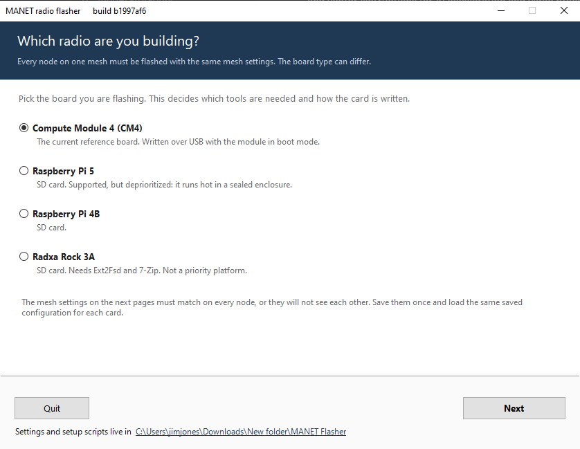

# MANET Project

Software for building mesh radios out of single-board computers. Flash a card,
power the node on, and it finds the others and starts carrying traffic for
them. Nothing assigns it an address, picks its channel, or decides which node
hosts the video stream. The nodes work that out between themselves, and keep
working it out as they move and as the mesh splits and rejoins.

Routing is `batman-adv` at Layer 2, running the BATMAN V algorithm. The radios
are 802.11ax/ac/n on 2.4 and 5 GHz, plus 802.11ah HaLow, which reaches much
further at much lower rates.

## What the nodes do on their own

Each node claims a block of IPv4 addresses for its own clients without
colliding with any other node, and IPv6 comes up over SLAAC. Nodes scan the 2.4
and 5 GHz bands, share what they found, and elect a channel together. Every
node computes the same answer from the same data, so there is no coordinator to
lose.

When a mesh splits in two, a node from each side takes turns hopping to a
common lobby channel to look for the other half, and the smaller partition
moves to rejoin the larger. When links start to degrade, a node says so, and
once more than half the mesh agrees, every node drops to the legacy 802.11
bitrates to keep the links alive.

Services are elected the same way. The best-connected node hosts MediaMTX for
video, another serves time to the rest of the mesh, and if either goes away the
next election moves the service elsewhere. Push-to-talk voice runs across the
mesh from a headset plugged into the node, mixing everyone who is talking.

## Repository layout

All of it sits under `MANET/`.

* `provisioning/` flashes a card. `additional-scripts/` inside it holds your
  own setup scripts, embedded in the image and run once on the node.
* `node_tools/` is what runs on the node: the orchestrator, the web interface,
  voice, the registry builder, and the script that configures a fresh radio.
* `binaries_arm64/` holds prebuilt `alfred` and `batctl`, and a
  `wpa_supplicant` patched for HaLow.
* `lyra_arm64/` holds the Lyra voice codec plugin and its model weights.
* `systemd/`, `systemd-network/`, `udev/`, `networkd-dispatcher/` and `etc/`
  are the units, network files and hooks installed onto the node.

## Supported Hardware

| Hardware | Support Level | Notes |
| :--- | :--- | :--- |
| **Compute Module 4 (CM4)** | Functional, primary dev target | Supports 802.11ax + HaLow. |
| **Raspberry Pi 4B** | Untested |  |
| **Raspberry Pi 5** | Functional, not a focus | Supports 802.11ax + HaLow. |
| **Radxa Rock 3A** | Functional, not a focus | Supports 802.11ax + HaLow. |

The Pi 5 and Rock 3A both work, but they run too hot for a sealed radio
enclosure, which is the form factor this project targets. They are no longer the
focus of testing. The CM4 is. Expect fixes to land and be verified on CM4
first.

## Getting Started

### 1. Prerequisites
You will need a supported SBC and a Linux or Windows machine to flash from, and ethernet Internet access for the SBC being flashed. 

See [/provisioning/README.md](MANET/provisioning/README.md) for detailed requirements and download links.

### 2. Provisioning a Node

#### On Windows: download one file

Download
**[Flash a Radio.cmd](https://raw.githubusercontent.com/very-srs/MANET/main/MANET/provisioning/Flash%20a%20Radio.cmd)**,
put it in a folder of its own, and double-click it.

That is the whole list. There is nothing else to download and nothing to install. The
launcher fetches what it needs, and the window offers to install `rpi-imager` and, for a
CM4, `rpiboot` if this computer does not already have them. On first run it makes itself a
`MANET Flasher` folder beside where you put it and moves in, so your saved settings and
your own setup scripts stay in one place.

Windows shows a security warning the first time, because the file came from the internet.
Choose **Run**, then **Yes** when Windows asks for Administrator: writing to a card needs
it.



Six pages, in order: pick the board, let it check this computer, enter the mesh settings,
review any setup scripts of your own, choose the card, and read the summary back before
anything is written.

Every page is shown in
[Windows: step by step](MANET/provisioning/README.md#windows-step-by-step).

> The older console script, `windows.ps1`, still works and does exactly the same thing.
> The window is a front end over it, so both produce an identical image.

#### On Linux

Download or clone the `MANET/provisioning` directory, then:

```bash
cd MANET/provisioning
sudo ./linux.sh
```

#### What you will be asked, on either host

* **EUD Connection**: Wired, Wireless (local AP), or Auto.
* **Optional Services**: MediaMTX, (Mumble is untested).
* **Mesh Security**: SSID and SAE Password.
* **Network Settings**: CIDR blocks and addressing.

Settings can be saved under a name and loaded again for the next card, which is how you
give every node on one mesh the same configuration. A saved configuration works in both
flashers, so a mesh can be built from a mix of Windows and Linux machines.

*(Optional)* Place site-specific setup scripts in `provisioning/additional-scripts/`. They
are validated before anything is written to the card, embedded in the image, and run
**once as root on the node** after the mesh is up: for static routes, organization SSH
keys, or additional packages. See
[Additional setup scripts](MANET/provisioning/additional-scripts/README.md).

### 3. First Boot
Insert the storage media into the node and power it on. The `firstrun.sh` script will, over the course of a few reboots:
1.  Disable default setup wizards.
2.  Wait for internet connectivity (via Ethernet) to download the latest kernel and tools.
3.  Install necessary packages (`batctl`, `alfred`, `wpa_supplicant`, etc.).
4.  Configure the radio interfaces.
5.  Leave a working mesh node.
6.  Run any scripts supplied in `additional-scripts/`. Their outcome is reported on
    the SSH login banner. A failure there does not mark the node unprovisioned.

## Web Interface

Each node serves two things on port 80, reachable from a device connected to
that node (Ethernet or its AP), or over an SSH port-forward:

* **`http://<node>/`**: status page. Mesh topology, link throughput, per-node
  health and detail. No password.
* **`http://<node>/manage`**: management UI. Radio control, throughput and ping
  measurement, saved sessions, uplink credentials, and the mesh configuration
  form. Requires the **admin password** chosen at flash time.

Both are restricted to that node's own clients and localhost, not other radios,
not other radios' clients, and not the upstream LAN when the node is acting as a
gateway. Nodes that resolve mDNS can also use `http://manet.local/`.

### Status page

Live mesh topology with per-link throughput, and a node list showing which radio carries
the best route to each peer.


Expanding a node gives its addresses, uptime, GPS and battery state, supply health, every
interface with the role it is playing, connected EUDs, and which services it is hosting.


### Management UI

**Radio config**: bring each interface up or down and set TX power, per node or across
the whole mesh at once, plus the HaLow channel.


**Measure**: run iperf3 and ping between any pair of nodes, in either direction, and
save the results against a labeled session so field tests can be compared later.


See [Node Tools Documentation](MANET/node_tools/README.md) for the routes,
access-control layers, and what each management tab does.

## Connectivity Modes

A phone, laptop or camera reaches the mesh through whichever node is nearest.
Those are End User Devices, EUDs throughout this documentation, and a node
handles them three ways:

* **Wired.** Over Ethernet. The node bridges the device onto the mesh, or acts
  as a gateway when the cable leads to the internet.
* **Wireless.** The node runs a 5 GHz access point, separate from the mesh
  backhaul, for clients to join.
* **Auto.** The default. Wireless until an Ethernet device appears, then wired
  takes priority.

## Documentation
* [Provisioning Guide](MANET/provisioning/README.md)
* [Additional setup scripts](MANET/provisioning/additional-scripts/README.md)
* [Node Tools Documentation](MANET/node_tools/README.md)
* [Binary Details](MANET/binaries_arm64/README.md)
* [Dispatcher Hooks](MANET/networkd-dispatcher/README.md)
